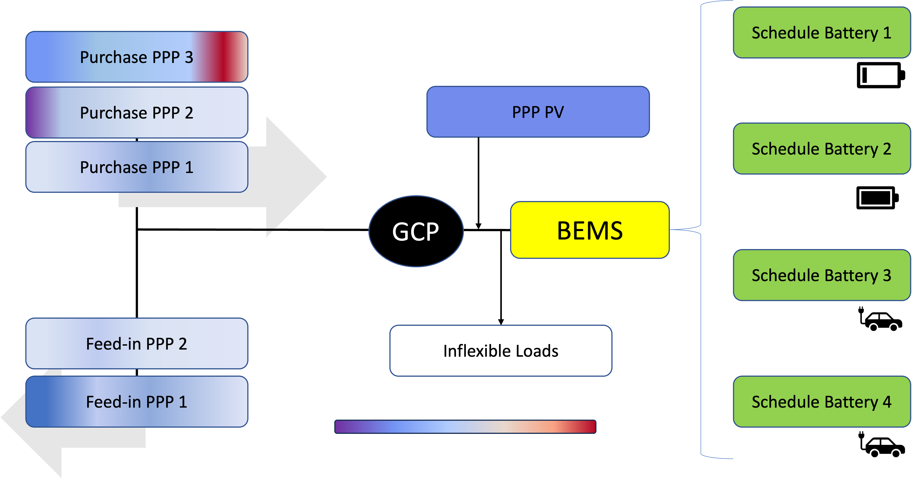

# Generic Battery Optimizer
This optimizer calculates cost-optimal schedules for batteries, including electric vehicles (EV). It is capable of considering multiple batteries/EVs,
bidirectional and unidirectional charging as well as multiple electricity sources. Electricity sources can be local photovoltaic plants, the public grid (including dynamic tariffs)
and any other electricity source that can be modeled with a cost and power profile. Furthermore, the power of all electricity sources can be limited in their power. This
is obligatory to model PV generation, but also power limits sent by the grid operator (e.g. German § 14a EnWG) can be taken into account. Exceeding the power limit can be either strictly 
forbidden or charged with certain costs. This allows to model time- and/or power-dependent tariffs.

## Overview
The Generic Battery Optimizer can be used in a building energy management system (BEMS) and optimize charging/discharging of batteries and EVs. EVs are modeled as batteries as well.
It takes PowerPriceProfiles and technical data of batteries as input and gives back the charging/discharging power of each battery, the calculated SoC and the power at the grid connection point (GCP).
PowerPriceProfiles cointain information about electricity prices and available power at a certain time period of an energy source or sink and can be used to model both dynamic tariffs from the grid, feed-in remuneration,
and PV generation.

# Getting started
## Installing an optimization backend
To run an optimizer an external Optimizer like GLPK, CPLEX or GUROBI is required. By default the optimizer uses the GLPK optimizer but others may be specified during optimization.

On Ubuntu GLPK can be installed with:
```bash
apt-get install gcc g++ glpk-utils libglpk-dev
```

On macOS GLPK can be installed using brew with:
```bash
brew install glpk
```

For other platforms see the [GLPK Website](https://www.gnu.org/software/glpk/)

## Install the optimizer

To install the optimizer as a Python package clone this repository and run 

```bash
pip install .
```

from the projects root folder.

## Run the optimizer with Python
The following example is provided in example/example.py that can be execuded directly to play around with. The simplest way of using the optimizer is with its wrapper method that handles creation of an optimizers instance, the solving and data retrieval from the optimized model.
This wrapper method accepts ProfileStack objects for its buy prices, sell prices and fixed consumption profiles. Batteries are a list of Battery objects.

### Step 1: Import necessary methods
Import the optimizer wrapper, power profile, profile stack and battery as needed:

```python
import random # Just for the random initialization of power/price values
import pandas as pd # Useful to generate time series for the indices
from battery_optimizer import optimize
from battery_optimizer.profiles.battery_profile import Battery
from battery_optimizer.profiles.profiles import ProfileStack, PowerPriceProfile
```

### Step 2: Create profile stacks and batteries
Profile stacks are a composition of one or more Power profiles. They can be defined as follows:

```python
# Buy profiles
grid_buy_profile = PowerPriceProfile(
    index=pd.date_range(start="2020-01-01", end="2020-01-02", freq="h"),
    price=[random.randint(10, 55) for _ in range(25)],
    power=[random.randint(2000, 10000) for _ in range(25)],
    name="Grid buy profile",
)

pv_profile = PowerPriceProfile(
    index=pd.date_range(start="2020-01-01", end="2020-01-02", freq="h"),
    price=[0 for _ in range(25)],
    power=[random.randint(0, 2000) for _ in range(25)],
    name="PV generation profile",
)

buy_profile_stack = ProfileStack([grid_buy_profile, pv_profile])

# Sell profile
grid_sell_profile = PowerPriceProfile(
    index=pd.date_range(start="2020-01-01", end="2020-01-02", freq="h"),
    price=[random.randint(5, 15) for _ in range(25)],
    power=[random.randint(2000, 10000) for _ in range(25)],
    name="Grid sell profile",
)

sell_profile_stack = ProfileStack([grid_sell_profile])

# Fixed consumption profile
consumption_profile = PowerPriceProfile(
    index=pd.date_range(start="2020-01-01", end="2020-01-02", freq="h"),
    power=[random.randint(200, 3500) for _ in range(25)],
    name="Consumption profile",
)

consumption_profile_stack = ProfileStack([consumption_profile])

# Batteries
household_battery = Battery(
    name="Household battery",
    start_soc=1,
    capacity=10000,
    max_charge_power=5000,
    max_discharge_power=5000,
)
```

### Step 3: Run the optimization
Finally pass all profile stacks and batteries to the optimizer wrapper te get the optimized power and soc profiles. All fields are optional but sufficiently high buy-capacity is needed if fixed consumption profiles are used or a batteries end soc is specified.

```python
buy_power, sell_power, battery_power, battery_soc, fixed_consumption = (
    optimize(
        buy_prices=buy_profile_stack,
        sell_prices=sell_profile_stack,
        fixed_consumption=consumption_profile_stack,
        batteries=[household_battery],
    )
)
```

### Step 4: Access the Data

After the optimization the power profiles are stored in pandas DataFrames. In the example above they are called `buy_power`, `sell_power`, `battery_power`, and `fixed_consumption`.
The column names are the given names of the batteries and all values represent the power in each time step.
The variable battery_soc contains the soc of the battery after each time period and its values represent soc values of the battery between zero and one.

### Manual usage
Instead of using the wrapper method the optimizer can be used manually, too. To do so import the necessary modules like above but instead of importing the wrapper method import the optimizer class with:

```python
from battery_optimizer.model import Optimizer
```

Create profile stacks and batteries as demonstrated above and construct the Optimizer with them:
```python
opt = Optimizer(
    buy_prices=buy_profile_stack,
    sell_prices=sell_profile_stack,
    fixed_consumption=consumption_profile_stack,
    batteries=[household_battery],
)
```

Construct the optimization model after all data is added with:
```python
opt.set_up()
```

Afterwards the problem can be solved. Other solvers can be specified here.
```python
opt.solve()
```

For a list on available solvers execute 
```bash
pyomo help --solvers
```
in a shell.

To retrieve the optimized profiles from the model, several methods are available from the battery_optimizer.export module to assist in extracting the data. Import the methods as necessary and pass the model (or for battery soc the optimizer class) to the export methods.

```python
from battery_optimizer.export import (
    to_battery_power,
    to_battery_soc,
    to_buy,
    to_fixed_consumption,
    to_sell,
)


to_buy(opt.model)
to_sell(opt.model)
to_battery_power(opt.model)
to_battery_soc(opt)
to_fixed_consumption(opt.model)
```

# Tests
To run the python tests provided run:
```bash
export PYTHONPATH=src
pytest tests
```

## Docker
From the tests directory run

```bash
docker-compose up --build
```

## Create Tests
test_helpers.py contains methods that reduce redundant operations for the tests.
Create Dictionaries with the data for the optimizer and a separate DateTimeIndex:

```python
profiles = {
    "profile_name": {
        "input_power": [10, 10, 0],
        "input_price": [1, 4, 0],
        "result_power": [10, 0, 0],
    },
}

index = pd.DatetimeIndex(
    [
        datetime(2021, 1, 1, 8, 0, 0),
        datetime(2021, 1, 1, 9, 0, 0),
        datetime(2021, 1, 1, 10, 0, 0),
    ]
)
```


Create the profiles from the dictionary:

```python
get_profiles(index, profiles)
```

Assert the profiles after optimization:

```python
assert_batteries(df, profiles)
```

## Battery Model
Each Battery can be described with the following attributes:

### name: str
The name of the battery to reference it in the model. If not supplied, it will be populated by a random alphanumerical string.

### start_soc: float
The initial SoC (State of Charge) of the battery in percent (0-1).

### end_soc: float
The SoC in percent (0-1) that shall be reached by the time `end_soc_time` is reached. After `end_soc_time`, the battery is not allowed to be discharged below `end_soc`. This value is optional.

### start_soc_time: datetime
The datetime that specifies the time of `start_soc`. This is usually the time when an EV is plugged in.

### end_soc_time: datetime
The datetime that specifies the time when `end_soc` should be reached. This is optional, but if it is supplied, `end_soc` must be supplied too.

### capacity: float
The capacity of the battery in Wh (Watt-hours).

### max_charge_power: float
The maximum power the battery can be charged with in W (Watts).

### min_charge_power: float
Minimum charging power of the battery if it is being charged. If this is specified the battery can either not charge or charge with at least the specified power but still adhere to the maximum charge power. If the maximum charge power is lower than the minimum charge power the battery will not be able to charge.

### max_discharge_power: float
The maximum power the battery can be discharged with in W. This is optional. If it isn't supplied, discharging the battery is not allowed.

### min_discharge_power: float
Minimum discharge power of the battery if it is being discharged. If this is specified the battery can either not be discharged or discharge with at least the specified power but still adhere to the maximum discharge power. If the maximum discharge power is lower than the minimum discharge power the battery will not be able to discharge.

### charge_efficiency: float
Efficiency of the charging process in percent.

### discharge_efficiency: float
Efficiency of the discharge process in percent.

### min_soc: float
Constraint the usable SoC range of the battery. Value is given in percent. This value is optional.

### max_soc: float
Constraint the usable SoC range of the battery. Value is given in percent. This value is optional.

## Handling charging processes
You can add multiple charging stations and charging processes. Every charging process will be handled like a battery within the
optimizer. This "battery" can only be used between start_soc_time and end_soc_time.

# Acknowledgements
This project has been funded by the German Ministry of Economic Affairs and Climate Action within the research project SynergieQuartier.