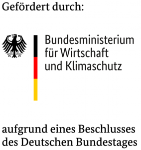

# Generic Battery Optimizer
This optimizer calculates cost-optimal schedules for batteries, including electric vehicles (EV), heat pumps, inflexible consumption profiles and flexible production or feed in profiles.
It is capable of considering an arbitrary combination of batteries, EVs - bidirectional and unidirectional charging - as well as multiple electricity sources and heat pumps. 
Electricity sources can be local photovoltaic plants, the public grid (including dynamic tariffs) and any other electricity source that can be modeled with a cost and power profile. Furthermore, the power of all electricity sources can be limited in their power. This
is obligatory to model PV generation, but also power limits sent by the grid operator (e.g. German § 14a EnWG) can be taken into account. Exceeding the power limit can be either strictly 
forbidden or charged with certain costs. This allows to model time- and/or power-dependent tariffs.
By default all energy sources can provide electricity for all consuming parts of the model and each consuming part can obtain its electricity from each electricity source. This can be restricted by power constraints on certain paths including combined power limits that can be used e. g. for solar power inverters that have a combined power output or input for a battery storage and the solar system. 

## Overview
It takes PowerPriceProfiles and technical data of batteries as input and gives back the charging/discharging power of each battery, the calculated SoC and the power at the grid connection point (GCP).
PowerPriceProfiles cointain information about electricity prices and available power at a certain time period of an energy source or sink and can be used to model both dynamic tariffs from the grid, feed-in remuneration,
and PV generation.

# Getting started
## Installing an optimization backend
To run an optimizer an external Optimizer like GLPK, CPLEX or GUROBI is required. By default the optimizer uses the GLPK optimizer but others may be specified during optimization.

On Ubuntu GLPK can be installed with:
```bash
apt-get install gcc g++ glpk-utils libglpk-dev
```

On macOS GLPK can be installed using brew with:
```bash
brew install glpk
```

For other platforms see the [GLPK Website](https://www.gnu.org/software/glpk/)

The easiest way to install [Gurobi](https://support.gurobi.com/hc/en-us/articles/4534161999889-How-do-I-install-Gurobi-Optimizer) is to use its Python version. This is fully sufficient to use this optimization model. It can be installed with:
```bash
pip install gurobi
```

Gurobi requires licensing to use this model. A license can be obtained free of charge for research purposes from the Gurobi [licensing portal](https://portal.gurobi.com/iam/login/?target=https%3A%2F%2Fportal.gurobi.com%2Fiam%2Flicenses%2Flist). The most flexible option is to use a Gurobi web license. This can be used machine independent including container usage but requires internet access.

## Install the optimizer

To install the optimizer as a Python package clone this repository and run 

```bash
pip install .
```

from the projects root folder.

## Using the optimizer with Python
The optimization model can be used in one of two ways. A manual way (recommended) which gives a more flexibility to and features and a simplified way that offers a quick ways to optimize simple energy systems. 

### Manual usage
The usage of the optimizer is a 8 (or 9) step process. Initializing the model, adding profiles and devices, generating the energy paths, adding optional constraints on energy paths, generating the objective, initializing a solver, solving the model and exporting the data from the model. 

#### Step 1: Create model with time series
The model is initialized with a time series that represents all time steps that shall be optimized. This time series can not be modified after the Model has been created.  
The time series must contain all time steps of the Model to build including sub-divisions used to model specific device behavior like charge start times of EVs. 

The time series is a list of timestamps. A convenient way to generate equidistant time series is to use the pandas date_range method.

```python
import pandas as pd
from battery_optimizer.model import Model
time_series = pd.date_range(start="2021-01-01 08:00:00", end="2021-01-01 10:00:00", freq="H")
my_model = Model(time_series)
```

#### Step 2: Add profiles and devices to the model
The Model class provides several methods to add profiles and devices to the model. 
The components take either directly serializable data as input or pydantic models that accept serializable data as inputs.
The methods return the created block for the model and can be stored for future use to reference the blocks in the model. This is needed to add power limits on energy paths.

Available Methods are:
|-----------------------|-------------------------------------------------------|
|Method                 |Device/Profile                                         |
|-----------------------|-------------------------------------------------------|
|add_battery            |Batteries - Home battery storage or EV assert_batteries|
|add_heat_pump          |Heat pumps - Air-Water or Water/Brine-Water Heat pumps |
|add_buy_profile        |Energy buy profiles - provide energy for a cost        |
|add_sell_profile       |Energy sell profiles - can sell energy for a revenue   |
|add_fixed_consumption  |Inflexible consumption - must be satisfied             |
|-----------------------|-------------------------------------------------------|

Refer to the documentation of the individual components for the requirements of the components.

```python
from battery_optimizer.profiles.battery_profile import Battery
buy_block = my_model.add_buy_profile(
    "buy",
    {
        time_series[0]: 10,
        time_series[1]: 10,
        time_series[2]: 0,
    },
    {
        time_series[0]: 1,
        time_series[1]: 4,
        time_series[2]: 0,
    }
)
sell_block = my_model.add_sell_profile(
    "sell",
    {
        time_series[0]: 10,
        time_series[1]: 10,
        time_series[2]: 0,
    },
    {
        time_series[0]: 0,
        time_series[1]: 3,
        time_series[2]: 0,
    }
)
battery_block = my_model.add_battery(
    Battery(
        name="battery",
        start_soc=0,
        end_soc=0,
        capacity=10000,
        max_charge_power=10000,
        max_discharge_power=10000,
        charge_efficiency=1,
        discharge_efficiency=1,
    )
)
```

#### Step 3: Generate energy paths
After all profiles and devices have been added the energy paths have to be generated with: 

```python
my_model.add_energy_paths()
```

#### Step 4 (Optional): Add power restrictions on energy paths
Specific energy paths can be restricted in the Model. This can be used to model combined power limits of multiple devices or profiles or restrict the use of energy flows e.g. to prevent feed-in from PV-Systems. 

Limits can be added for individual devices or for lists of devices. When using lists the sum of the power usage will be restricted. 
```python
my_model.constraint_device_power(battery_block, sell_block, 0)
my_model.constraint_device_power(buy_block, battery_block, 0)
```

If only a combined power limit on some of the devices is desired but all energy paths should still be allowed the methods *constraint_device_power_source* *constraint_device_power_sink* can be used to add combined power limits for energy sources or energy sinks respectively. 

#### Step 5: Generate objective
Once the energy matrix is generated and the all power restrictions have been added the objective of the model has to be generated with:
```python
my_model.generate_objective()
```

The model is now finalized and ready to be handed over to a solver. 

#### Step 6: Initialize a solver
This package provides a Solver class that simplifies the solving of models.
Solvers are initialized separately and can be reused to solve multiple models using the same underlying solver. For more complex solving strategies please refer to the pyomo documentation te see all available options to solve models. 

To use the provided solver wrapper initialize a solver with:
```python
from battery_optimizer.solver import Solver
solver = Solver("gurobi")
```
To customize the behavior of the solver an options dictionary can be specified during initialization. These differ between solvers.

For a list on available solvers execute 
```bash
pyomo help --solvers
```
in a shell.

#### Step 7: Solve the model
To start the solving of a model use the solve method of a solver and pass the pyomo model of the finalized model to the method. 
```python
solver.solve(my_model.model)
```

Once the optimization of the model is finished the model is populated with the data of the best solution. This data can be retrieved from the model.

### Step 8: Initialize an Exporter with the solved model
To retrieve the data from the model an exporter class is provided.
The exporter class offers multiple export methods to export the solved data from the solved model. Data can be exported as a dictionary, pandas DataFrames or as an Excel file.

All exports are initiated from the Exporter class which accepts a model as an input and provides methods to export the data. 
```python
from battery_optimizer.export.model import Exporter
export = Exporter(my_model)
export.to_df()
export.to_dict()
export.write_excel()
```

More data can be exported from the model by inspecting the model itself. 

#### Step 9: Using the DataFrame Exporter to export the data
Exporting the data to pandas DataFrames is a two step process. Exporting the data as a complete pandas representation and exporting the individual profile and device classes afterwards. To export data for profiles and devices the pandas exporter provides the following methods:
```python
export.to_buy()
export.to_sell()
export.to_battery_power()
export.to_battery_soc()
export.to_fixed_consumption()
export.to_heat_pump_power()
```

### Simplified usage (less complete)
The simplified usage gives quick access to a subset of the models features. 
It is the simplest way of using the optimizer. It provides a wrapper method that handles creation of a model instance, adds specified profiles and devices to the model, solves it and retrieves the data from the optimized model.
This wrapper method accepts ProfileStack objects for its buy prices, sell prices and fixed consumption profiles. Batteries are a list of Battery objects and heat pumps are a list of HeatPump objects.

The following example is provided in example/example.py and can be executed directly to play around with. 

#### Step 1: Import necessary methods
Import the optimizer wrapper, power profile, profile stack and battery as needed:

```python
import random # Just for the random initialization of power/price values
import pandas as pd # Useful to generate time series for the indices
from battery_optimizer import optimize
from battery_optimizer.profiles.battery_profile import Battery
from battery_optimizer.profiles.heat_pump import HeatPump
from battery_optimizer.profiles.profiles import ProfileStack, PowerPriceProfile
```

### Step 2: Create profile stacks and batteries
Profile stacks are a composition of one or more Power profiles. They can be defined as follows:

```python
# Buy profiles
grid_buy_profile = PowerPriceProfile(
    index=pd.date_range(start="2020-01-01", end="2020-01-02", freq="h"),
    price=[random.randint(10, 55) for _ in range(25)],
    power=[random.randint(2000, 10000) for _ in range(25)],
    name="Grid buy profile",
)

pv_profile = PowerPriceProfile(
    index=pd.date_range(start="2020-01-01", end="2020-01-02", freq="h"),
    price=[0 for _ in range(25)],
    power=[random.randint(0, 2000) for _ in range(25)],
    name="PV generation profile",
)

buy_profile_stack = ProfileStack([grid_buy_profile, pv_profile])

# Sell profile
grid_sell_profile = PowerPriceProfile(
    index=pd.date_range(start="2020-01-01", end="2020-01-02", freq="h"),
    price=[random.randint(5, 15) for _ in range(25)],
    power=[random.randint(2000, 10000) for _ in range(25)],
    name="Grid sell profile",
)

sell_profile_stack = ProfileStack([grid_sell_profile])

# Fixed consumption profile
consumption_profile = PowerPriceProfile(
    index=pd.date_range(start="2020-01-01", end="2020-01-02", freq="h"),
    power=[random.randint(200, 3500) for _ in range(25)],
    name="Consumption profile",
)

consumption_profile_stack = ProfileStack([consumption_profile])

# Batteries
household_battery = Battery(
    name="Household battery",
    start_soc=1,
    capacity=10000,
    max_charge_power=5000,
    max_discharge_power=5000,
)
```

### Step 3: Run the optimization
Finally pass all profile stacks and batteries to the optimizer wrapper te get the optimized power and soc profiles. All fields are optional but sufficiently high buy-capacity is needed if fixed consumption profiles are used or a batteries end soc is specified.

```python
(
    buy_power,
    sell_power,
    battery_power,
    battery_soc,
    fixed_consumption,
    heat_pump_power,
) = optimize(
    buy_prices=buy_profile_stack,
    sell_prices=sell_profile_stack,
    fixed_consumption=consumption_profile_stack,
    batteries=[household_battery],
)
```

### Step 4: Access the Data

After the optimization the power profiles are stored in pandas DataFrames. In the example above they are called `buy_power`, `sell_power`, `battery_power`, and `fixed_consumption`.
The column names are the given names of the batteries and all values represent the power in each time step.
The variable battery_soc contains the soc of the battery after each time period and its values represent soc values of the battery between zero and one.

# Extending functionality
The optimization model is designed to be extensible with minimal effort. Each profile or device is implemented as its own pyomo block.

## Creating the block
To implement a new block create a new file in src > battery_optimizer > blocks and add the following template to the file:

```python
class MyBlock:
    def __init__(self, index: pyo.Set, my_block_information: MyBlockPydantic):
        self.index = index
        self.my_block_information = my_block_information

    def build_block(self) -> pyo.Block:
        """Build the block"""
        block = pyo.Block()
        # DEFAULT
        # Source in Matrix
        block.energy_source = pyo.Var(self.index, bounds=(0, 0), initialize=0)
        block.price_source = pyo.Param(self.index, initialize=0, mutable=True)
        # Sink in matrix
        block.energy_sink = pyo.Var(self.index, bounds=(0, 0), initialize=0)
        block.price_sink = pyo.Param(self.index, initialize=0, mutable=True)
        # Construct variables and parameters
        block.energy_source.construct()
        block.price_source.construct()
        block.energy_sink.construct()
        block.price_sink.construct()
        # DEFAULT

        ### Your device implementation

        return block
```

The index takes the models index and extra information about the device as an input. Information of the device should ideally be serializable data, so standard data types or pydantic models are a good choice.

The block is built using the method ''build_block()'' and returns the built block. every block must specify the variables ''energy_source'' and ''energy_sink'' and the parameters ''price_source'' and ''price_sink''. These are used by the energy matrix to calculate the energy flows. All restrictions of the device should work with these variables to meet the devices requirements. The price parameters are used by the model in the objective to determine the cost or revenue of energy usage.

To set other limits than 0 on the energy variables use the ''setub'' and ''setlb'' to set the lower and upper bound of the variable. To specify prices for the price parameters use the ''set_value'' method to set them.

## Adding the block to the model
Import the new block in battery_optimizer.model and add a method to add this block to the model. This should need minimal calculations in the Model class itself. All necessary calculations should be made during the blocks creation in the block. 

This code should be sufficient for most components with only minor changes:
```python
def add_my_block(self, my_block_information: MyBlockPydantic) -> pyo.Block:
        """Add a new my component to the model

        Description of the component

        Variables
        ---------
        my_block_information : BaMyBlockPydanticttery
            The component to add to the model.
        """
        self.model.my_block_type.add_component(
            name=my_block_information.name,
            val=MyBlock(self.model.i, my_block_information).build_block(),
        )
        return self.model.my_block_type.component(my_block_information.name)
```

Add the new block to battery_optimizer.static.model.COMPONENT_MAP. This specifies the name of the block category used in the model and must be unique and match the name used above in the ''add_my_block'' method

```python
COMPONENT_MAP: dict[type, str] = {
    ...,
    MyBlockPydantic: "my_block_type",
}
```

## Allow export of the block data
Some exporters may need te be extended to export the data from new blocks. The to_dict method of the exporter should export power information of the new component automatically but the pandas DataFrame exporter does not automatically.

To export the component as a DataFrame add a new method to the ModelDataFrame class which exports the relevant data for the component. A simple power output for the component would work like the following example:

```python
def to_my_component(self) -> pd.DataFrame:
        """Create a DataFrame with all my_component power profiles

        Device description.

        Each value represents the total constant power the device consumes during a time period.
        Indexed by the timestamps from which the specified power should be
        used by a device.
        my_component profiles have positive power when they consume power.

        Returns
        -------
        pd.DataFrame
            The power in W of each my_component profile.
        """
        my_component_df = pd.DataFrame(
            {
                device: values["source"]
                for device, values in self._model_dict[
                    "my_block_type"
                ].items()
            }
        )
        return ModelDataFrame.__convert_to_power(my_component_df)
```

If the device can be both a sink and a source its total power will probably be the sink-power subtracted by the source power. If so 
```python
pd.DataFrame(
    {
        device: pd.Series(values["sink"])
        - pd.Series(values["source"])
        for device, values in self._model_dict["my_block_type"].items()
    }
)
```
can be used to calculate this. 


# Tests
To run the python tests provided run:
```bash
export PYTHONPATH=src
pytest tests
```

## Docker
From the tests directory run

```bash
docker-compose up --build
```

## Create Tests
test_helpers.py contains methods that reduce redundant operations for the tests.
Create Dictionaries with the data for the optimizer and a separate DateTimeIndex:

```python
profiles = {
    "profile_name": {
        "input_power": [10, 10, 0],
        "input_price": [1, 4, 0],
        "result_power": [10, 0, 0],
    },
}

index = pd.DatetimeIndex(
    [
        datetime(2021, 1, 1, 8, 0, 0),
        datetime(2021, 1, 1, 9, 0, 0),
        datetime(2021, 1, 1, 10, 0, 0),
    ]
)
```


Create the profiles from the dictionary:

```python
get_profiles(index, profiles)
```

Assert the profiles after optimization:

```python
assert_batteries(df, profiles)
```

## Battery Model
Each Battery can be described with the following attributes:

### name: str
The name of the battery to reference it in the model. If not supplied, it will be populated by a random alphanumerical string.

### start_soc: float
The initial SoC (State of Charge) of the battery in percent (0-1).

### end_soc: float
The SoC in percent (0-1) that shall be reached by the time `end_soc_time` is reached. After `end_soc_time`, the battery is not allowed to be discharged below `end_soc`. This value is optional.

### start_soc_time: datetime
The datetime that specifies the time of `start_soc`. This is usually the time when an EV is plugged in.

### end_soc_time: datetime
The datetime that specifies the time when `end_soc` should be reached. This is optional, but if it is supplied, `end_soc` must be supplied too.

### capacity: float
The capacity of the battery in Wh (Watt-hours).

### max_charge_power: float
The maximum power the battery can be charged with in W (Watts).

### min_charge_power: float
Minimum charging power of the battery if it is being charged. If this is specified the battery can either not charge or charge with at least the specified power but still adhere to the maximum charge power. If the maximum charge power is lower than the minimum charge power the battery will not be able to charge.

### max_discharge_power: float
The maximum power the battery can be discharged with in W. This is optional. If it isn't supplied, discharging the battery is not allowed.

### min_discharge_power: float
Minimum discharge power of the battery if it is being discharged. If this is specified the battery can either not be discharged or discharge with at least the specified power but still adhere to the maximum discharge power. If the maximum discharge power is lower than the minimum discharge power the battery will not be able to discharge.

### charge_efficiency: float
Efficiency of the charging process in percent.

### discharge_efficiency: float
Efficiency of the discharge process in percent.

### min_soc: float
Constraint the usable SoC range of the battery. Value is given in percent. This value is optional.

### max_soc: float
Constraint the usable SoC range of the battery. Value is given in percent. This value is optional.

## Handling charging processes
You can add multiple charging stations and charging processes. Every charging process will be handled like a battery within the
optimizer. This "battery" can only be used between start_soc_time and end_soc_time.

# Citing
Please consider citing us if this software and/or the accompanying scientific paper was useful for your work.
```
Tobias Riedel, Carl Hauschke, and Hartmut Schmeck. 2025.
Power-Dependent Price Profiles - Defining Grid- and Market-Oriented Incentives for Building Energy Management Systems.
SIGENERGY Energy Inform. Rev. 4, 4 (October 2024), 78–87.
https://doi.org/10.1145/3717413.3717420
```

# Acknowledgements
This project has been funded by the German Ministry of Economic Affairs and Climate Action between 2020 and 2023 within the research project SynergieQuartier.
Further developments have been funded by the European Union within the Horizon Europe project WeForming. 

<p>
  
  
</p>
